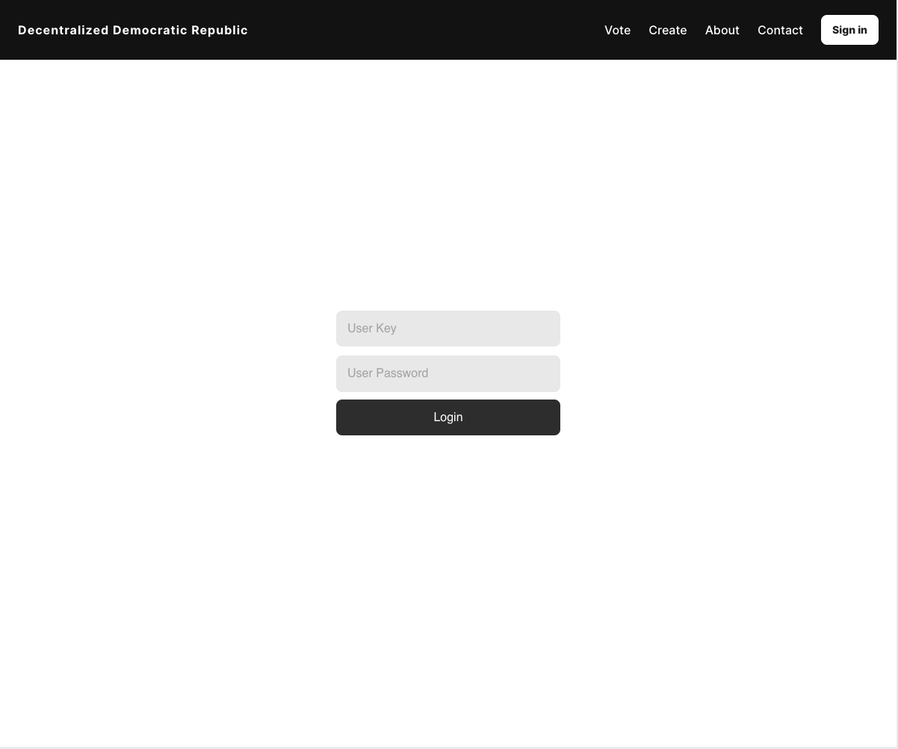
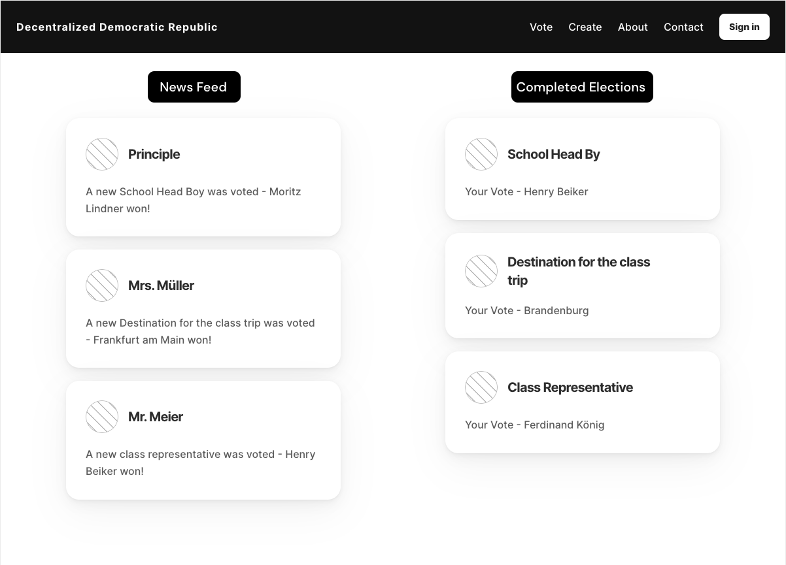
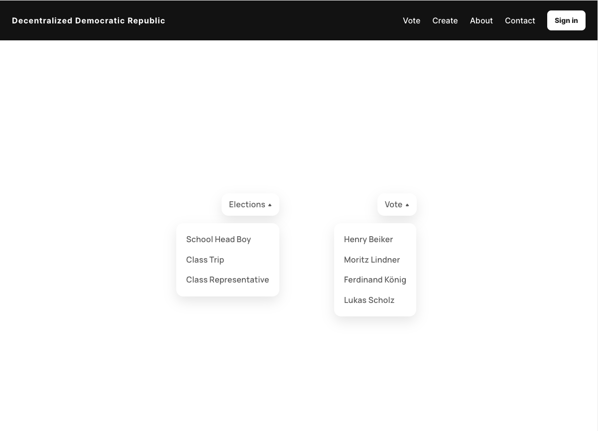
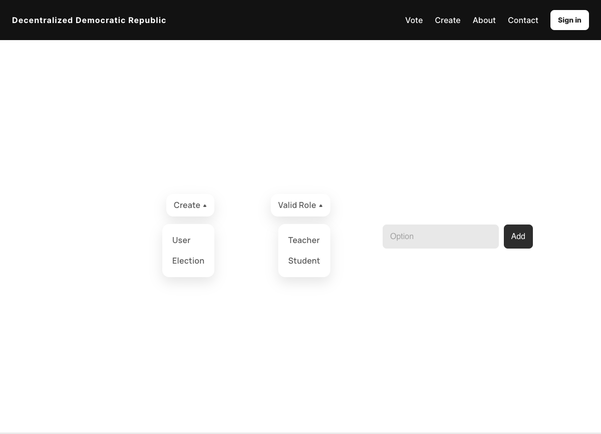

# Decentralized Democratic Republic
The idea of a decentralised voting website in school is a way to teach pupils about the importance of democratic processes and at the same time use interesting technologies. Politics and democracy are taught in school, but implementation is often neglected. Our website creates transparency and trust by storing events such as votes on class trips, school representative elections etc. on the blockchain. This ensures the traceability of the results. In addition, versioning is solved digitally and transparently.
Furthermore, news from the school, such as new teachers, can also be stored. This means that students can be offered a newsfeed that displays the latest information after logging in.

## Getting Started
### Prerequisites
- [Node.js](https://nodejs.org/en/)
- [Truffle](https://www.trufflesuite.com/truffle)
    - `npm install truffle --location=global`
- [Ganache](https://www.trufflesuite.com/ganache)

## Run Project

1. Setup a local blockchain with Ganache 
2. Setup MetaMask to connect to Ganache
3. Compile and deploy the contracs
   - `cd contracts
   - `truffle compile`
   - `truffle migrate`
4. [Dev] Run test
   - `npm test`
5. Run webclient
   - `cd webclient`
   - `npm install` (when running for the first time)
   - `npm start`
   - open http://localhost:3000 in your browser

## Mock Ups
### Login Page

### Landing Page

### Voting Page

### Creating Page
